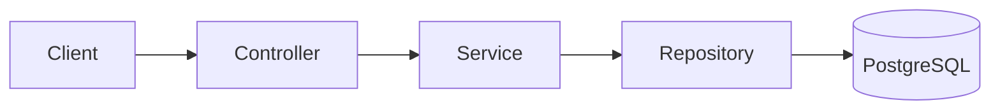

# chat_rooms

A Java API for real-time chat rooms with JWT authentication, room membership limits, and message history.
It provides WebSocket (STOMP) messaging, REST endpoints, and Redis-backed presence/rate limiting.

<p align="center">
  
  
  
  
  
  
  
  
</p>

## Architecture Overview

The project follows a layered architecture:
Controller → Service → Repository → Database, with WebSocket handlers for real-time events.
Redis is used for presence, rate limiting, and pub/sub between instances.



## How It Works

- HTTP requests are handled by REST controllers and validated at the DTO layer.
- Services implement business rules (auth, rooms, membership, pagination).
- Repositories encapsulate database access (JPA + Flyway migrations).
- WebSocket messages are processed, validated, persisted, and published to Redis.
- Redis pub/sub fans out messages to all instances, which then broadcast to WebSocket clients.
- JWT is validated on REST endpoints and during WebSocket handshake.

## Project Structure

```
src/main/java/com/josevitor/chatrooms
├── auth            # JWT auth, login/register, auth filter
├── config          # security, Redis, error handling, properties
├── messages        # WS message handling, persistence, history
├── rooms           # rooms, membership, presence, retention
└── users           # user entity and repository
```

## Running the Application

### Running locally

**Prerequisites**
- Java 21
- Docker + Docker Compose

**Start dependencies**
```bash
docker compose up -d
```

**Configure environment**
```bash
cp .env.example .env
```

Edit `.env` as needed.

**Run**
```bash
./mvnw spring-boot:run
```

The API will be available at `http://localhost:8081`.

### Running with Docker

A Dockerfile is not provided. Use Docker Compose for dependencies and run the app locally with Maven.

## Environment Variables

| Variable | Description | Default |
| --- | --- | --- |
| `JWT_SECRET` | Secret used to sign JWTs | `dev-secret-change-me-please-32-chars-min` |
| `REDIS_HOST` | Redis host | `localhost` |
| `REDIS_PORT` | Redis port | `6379` |
| `APP_RATE_LIMIT_MESSAGES_PER_SECOND` | WS rate limit per user | `5` |

## API Endpoints

| Method | Route | Description |
| --- | --- | --- |
| POST | `/auth/register` | Register a new user |
| POST | `/auth/login` | Authenticate and return JWT |
| GET | `/me` | Return current user |
| POST | `/rooms` | Create a room |
| GET | `/rooms` | List rooms |
| GET | `/rooms/{id}` | Get room details |
| POST | `/rooms/join` | Join room by join code |
| POST | `/rooms/{id}/leave` | Leave room |
| GET | `/rooms/{id}/messages` | Cursor-based message history |

## Good Practices

- Clear separation of concerns across controller/service/repository.
- Dependency injection for testability and configuration.
- Stateless JWT authentication for REST and WS handshake.
- Flyway-managed migrations for schema control.
- Redis-based rate limiting and pub/sub for horizontal scaling.
